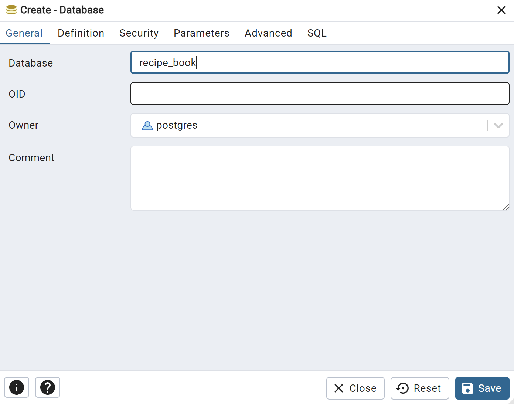
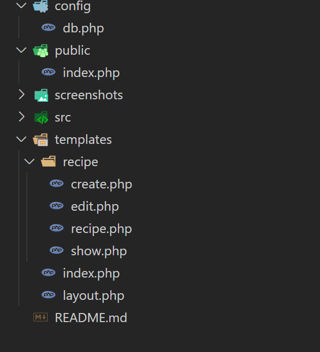

# Лабораторная работа №5. Работа с базой данных

## Студент
**Gachayev Dmitrii I2302**  
**Выполнено 11.04.2025**  

## Цель работы
Освоить архитектуру с единой точкой входа, подключение шаблонов для визуализации страниц, а также переход от хранения данных в файле к использованию базы данных (MySQL).

## Задание 1. Подготовка среды
Для работы буду использовать субд `PostgreSQL`. 

1. Создаю базу данных `recipe_book` через `pgAdmin`:



2. Создаю таблицу `recipes` (запрос переделал под `postgresql`)
```sql
CREATE TABLE recipes (
  id SERIAL PRIMARY KEY,
  title VARCHAR(255) NOT NULL,
  category INT NOT NULL,
  ingredients TEXT,
  description TEXT,
  tags TEXT,
  steps TEXT,
  created_at TIMESTAMP DEFAULT CURRENT_TIMESTAMP,
  FOREIGN KEY (category) REFERENCES categories(id) ON DELETE CASCADE
);
```

3. Далее создаю таблицу `categories` (запрос переделал под `postgresql`)
```sql
CREATE TABLE categories (
  id SERIAL PRIMARY KEY,
  name VARCHAR(100) NOT NULL UNIQUE,
  created_at TIMESTAMP DEFAULT CURRENT_TIMESTAMP
);
```

## Задание 2. Архитектура и шаблонизация
1. Создаю файл `public/index.php` и настраиваю простую маршрутизацию: 
```php

<?php
$request = $_SERVER['REQUEST_URI'];

switch ($request) {
    case "/": // just in case
        require_once '../templates/index.php';
        break;
    case "/index":
        require_once '../templates/index.php';
        break;

    case '/create': 
        require_once '../templates/recipe/create.php';
        break;

    case '/recipe':
        require_once '../templates/recipe/recipe.php';
        break;

    default:
        http_response_code(404);
        echo '<h1>404 — Страница не найдена</h1>';
        break;
}
```

2. Создаю файл `templates/layout.php` который будет служить базовым шаблоном для всех страниц:

```html
<!DOCTYPE html>
<html lang="ru">
<head>
    <meta charset="UTF-8">
    <title><?= $title ?? 'Рецепты' ?></title>
    <link rel="stylesheet" href="/style.css">
</head>
<body>
    <header>
        <h1>Книга рецептов</h1>
        <nav>
            <a href="/">Главная</a> |
            <a href="/create">Добавить рецепт</a>
        </nav>
    </header>
    <main>
        <?= $content ?>
    </main>
</body>
</html>
```

3. Создаю шаблоны для `index.php`, `create`, `recipe`.

`index.php`:
```php
<?php
$title = 'Все рецепты';
ob_start();
?>

<h2>Список рецептов</h2>
<ul>
    <li><a href="/recipe?id=1">Борщ</a></li>
    <li><a href="/recipe?id=2">Плов</a></li>
</ul>

<?php
$content = ob_get_clean();
require 'layout.php';
```

`create.php`:
```php
<?php
$title = 'Добавить рецепт';
ob_start();
?>

<h2>Добавить рецепт</h2>
<form action="/save" method="POST">
    <label>Название:<br><input type="text" name="title" required></label><br>
    <label>Категория:<br><input type="text" name="category"></label><br>
    <label>Ингредиенты:<br><textarea name="ingredients"></textarea></label><br>
    <label>Описание:<br><textarea name="description"></textarea></label><br>
    <label>Шаги:<br><textarea name="steps"></textarea></label><br>
    <button type="submit">Сохранить</button>
</form>

<?php
$content = ob_get_clean();
require __DIR__ . '/../layout.php';
```

`recipe.php`:
```php
<?php
$title = 'Рецепт';
ob_start();

?>

<h2>Борщ</h2>
<p><strong>Категория:</strong> Первое блюдо</p>
<p><strong>Ингредиенты:</strong> Свёкла, капуста, мясо, картофель</p>
<p><strong>Описание:</strong> Классический украинский борщ</p>
<p><strong>Шаги:</strong></p>
<ol>
    <li>Отварить мясо</li>
    <li>Добавить овощи</li>
    <li>Тушить до готовности</li>
</ol>

<?php
$content = ob_get_clean();
require __DIR__ . '/../layout.php';
```

Итоговая структура проекта:

